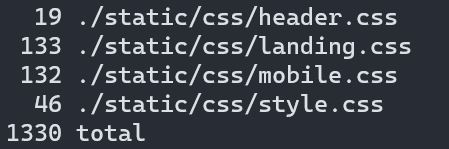
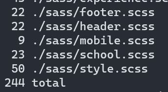

# my personal website yet again in zola 

[](https://github.com/lhao03/lhao03.github.io/actions/workflows/main.yml)

## codes i yoinked:
- for dark mode: http://jzhao.xyz/
- for highlight thingy: https://github.com/rmehri01/Personal-Website

## websites i was inspired by (in no particular order):
- https://justina.tech/, http://jzhao.xyz/, https://www.katmh.com/, http://joicetang.com/, https://kristen.dev/

## why hugo to zola? and css to scss?
- hugo docs are confusing
- hugo feels like magic; i dont even know how it works 99% of the time
- scss has cool features like nesting
- i really like static website generators so i had to try out zola

## a comparison



## how to make it work
- install zola: https://www.getzola.org/documentation/getting-started/overview/
- to render the site ```zola serve```.

test