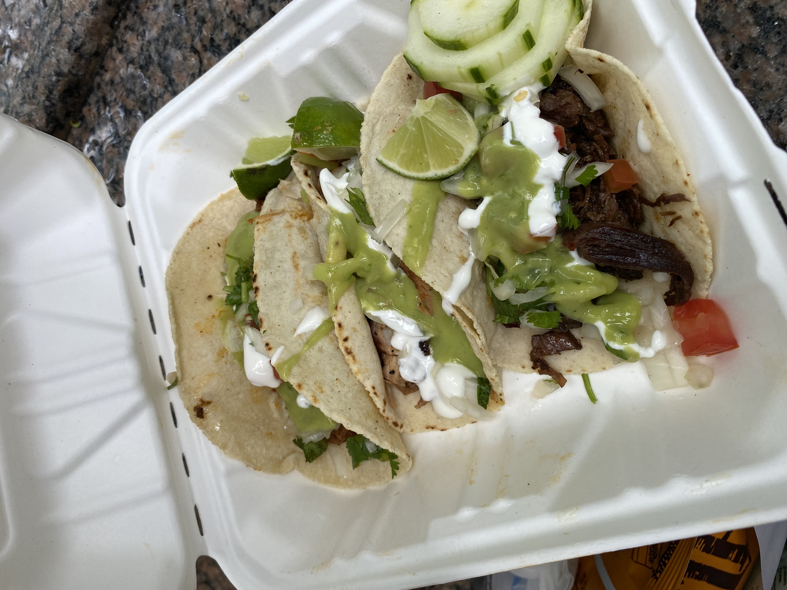

:toc: 

Just a informal log of day to day feelings.
 
= June
== June 19
lazy day, got in a good leg day, ate a bunch of kitkats and hichew. more
existential thinking about what i wanna do.

== June 18
went to hmart and trader joe's today! also got pastrami, corned beef and reuben sandwiches and mango green tea. 

image::images/log/june18.png[]

== June 17
image::images/log/june17.png[]

== June 16
boring day. was sleepy.

== June 15
finally wrote some code. 😩 using vim at work is a flex until u start making a mess of commands.

== June 14 
went shopping and got a donut. 

== June 13
nothing much.

== June 12
i got lost buying groceries, found a street with a bunch of food trucks, bought tacos, and then while walking back to the apartment walked into a movie set.

== June 11
for some reason i can't sleep at night but i can fall asleep in seconds during
	the day? i slept at 1, woke up at 6, went ot the gym, then slept from 7
	to 930.

gonna just read some papers, write a bit, relax. i wanna buy new running shoes and shorts though.

== June 10
how does taxes work for a dual citizen. 

anyways, on a whim i joined the other interns and went to central park and times square!

image::/images/log/june10.png[]

== June 9
macbook is still busted. been speedrunning onboarding and kind of realizing i
do not really like living in downtown. entities that are very valuble to my
	daily happiness include wholesale stores (like Costco), Asian stores
	(T&T), lots of empty or near empty trails for running, and air that
	doesn't smell like garbage? lots of interns here are going to bars and
	eating out most days of the week, and i can't really force myself to
	join them, because i feel like i'm spending a lot of money and im kinda scared of going to a bar.
	another dynamic difference is that there are alot more male interns. at
	microsoft, the split was pretty even, whereas at capital one there's
	probably like 10 male interns for every female intern. it's a bit
	isolating to say the least. 

on the other hand, i've been reading a theory of computation textbook and
beautiful racket and i really enjoy it. 

== June 8
i slept past my alarm by 4 hours and missed the first laptop set up session. ooooof

== June 7
got a bagel. 

image::/images/log/june7.jpg[]

== June 6
nyc day 2. arrived last night very tired. currently just vibing. wall street is
pretty nice. the architecture in nyc is very variable. sometimes it reminds me
of downtown vancouver. took a walk around, there's a body of water and i saw
people with ice cream but i couldn't figure out where they were getting that
ice cream. also there's just like trash bags everywhere.

== June 3
another day where i did nothing. was exhausted. 

== June 2
was trying to get some rust stuff to work and it wasn't and that kinda annoyed
me. i don't think i like "learning through hacking". i like having enough
knowledge to "figure it out myself", so to speak. i don't think i don't like
"unfamiliar problems" but i really hate just feeling like i'm in the dark. in
chemistry and cpsc 110, i'd frequently do "hard problems" or "new problems" (of
course to a computer scientist or chemist these problems aren't hrd or new but
to a noob like me they are.) like my ochem class kicked my ass, and we had to
literally create reaction mechanisms for chemical molecules that don't exist.
there's no "search that chemical molecule up on google" because my chem proof
literally pulled it out of his brain. anyways, people always say "you didn't
waste your time" when you struggle to learn. when i've spent 4 hours trying to
think of a reaction mechanism i've reinforced my knowledge of chemistry and i
now "know what doesn't work and why". but when i "learn through hacking" and i
come across the solution by luck after like 5 hours, i just feel like i've
wasted all this time. i don't know why what i was doing doesn't work and why
this random internet solution does work. 

i was never the kid who "put computers together" like lmfao. i just read books
about fairies and shit. my dad bought me a circuit game thing, and i put
together the circuits, saw the light blink and was like ok.

== June 1
tired.

= May

== May 31
ubc does course registration based on your year standing, and i majorly fucked
up in second year by not making sure i was taking enough cs/math courses to be
promoted to third year (i was 0.4 credits away from being promoted to third
year standing). since i was stuck in second year standing, i got a shit
registration time (second year students are the last to register for courses),
so this meant i got "whatever was left" and i couldn't register for literally
any third year CS courses even though the only second year courses i only left
to do were the required second year math courses. i randomly got a seat into
cspc 313 because i kept checking the ssc every like 5 mins and then was one of
the last students to get moved off the waitlist into cpsc 320. and then i saw
like at least 10-20 people drop the third year cs courses i wanted to take but
i couldnt register for since it was past the register date, and i wasn't keen
on joining a course like 3 weeks into it. since i could only register for 2
third year courses i couldn't get promoted to fourth year (this is my fourth
year at ubc but im in third year standing now). and now i have to do a bunch of
course schedule juggling between my chem and cs courses, and one of the cs
courses i was planning to take suddenly changed times and that threw my whole
schedule out of balance and now i'm replanning my next two years again. in
second year i was a super confused student, and i was exploring courses in micb
and chem, instead of taking the required math courses, and i feel like i was
punished for "exploring". i kinda wish i had an advisor (my friend at an ivy
school gets assigned their own advisor and they meet like a few times
throughout the year). anyways i guess i feel stressed, because course planning
is just another thing i have to worry about along with all the stuff happening
in the world.

i also procrastinated something i should have done like one month ago. 
