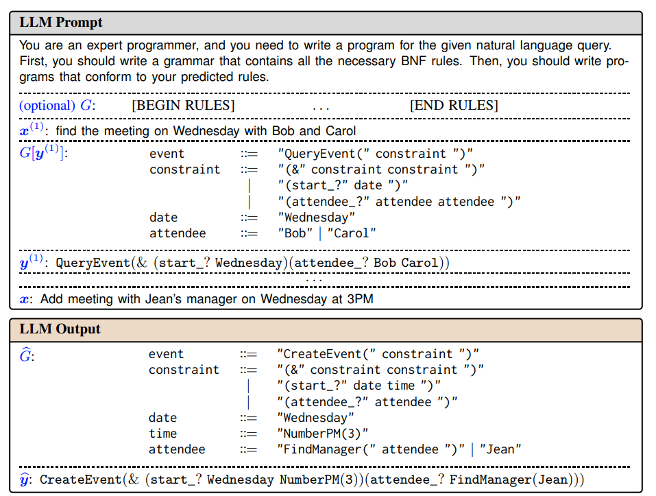

* https://arxiv.org/pdf/2305.19234
* https://github.com/berlino/grammar-prompting

"This approach is however inadequate for applications where the task specifications cannot be fully delineated through just a handful of exemplars, for example in semantic parsing where an LLM must translate a natural language utterance to an executable program in a domain-specific language (DSL)"

* many DSLs have not been seen during pretraining, so how to use LLMs to to generate strings -> grammer prompting
** given an input LLM tries to predict BNF grammar, then generates answer based on grammar
** similar to enhancing work by interleaving intermediate "reasoning" steps between each in-context input and output
** intermediate variable is form of formal grammer

* design constrained LLM decoding algorithm tailored to grammar prompting

* constrained decoding:
** Earley parser -> challenging if only using API based LLM
** instead, Earley-based parser, steps are:
image:../../../image/hein/earley-based.png[]
