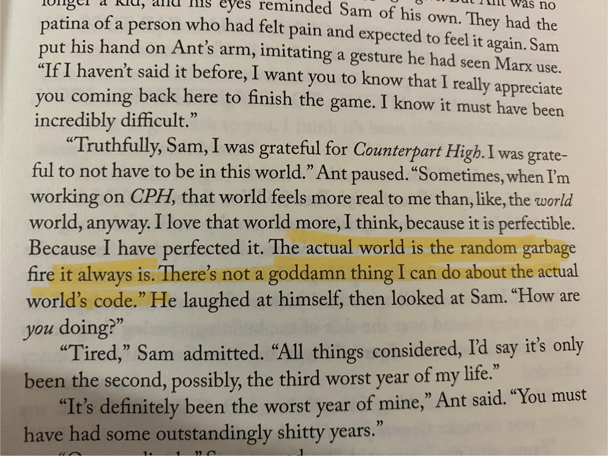

With no control over my hands, any game with mechanics is immensely fustrating for me to play. With my lack of mechanics, I discovered link:https://teamfighttactics.leagueoflegends.com/[Teamfight Tactics], which is an autobatter game that I've spent some hours playing. As I become more and more intrigued with the game, I started studying different strategies and analyzing statistics. After a game I'd spend a few minutes analyzing how I could have played better, or how other people formed stronger boards. Even though TFT was "just a game", I'd dicuss game mechanics and balance patchces with my boyfriend, trying to justify if my actions were wrong or right, and if I correctly dealt with instances of luck and oppertunity the game dealt me.

== TFT: luck or skill?

In TFT you are given resources in the form of item components, HP and gold. You are free to use these resources as you wish, with gold allowing you to buy units or increase you level, HP being how much "life" you have left and 0 meaning you've "died", and item components for building items. Gold is also the most complex resource.

I've been experimenting with different TFT playstyles, and one I enjoy is "fast 9/10". To get to level 9, you need to save up all your economic resources during the early game, trading your player health for gold. If you're lucky and can easily get 2-stars of 1/2 costs during the early levels, then you should look towards this playstyle, getting a winstreak, which gives you gold without the expense of trading your player health. Of course, you can also force a losetreak, to get gold at the expense of player health. Once you're at level 9 or 10, you buy high cost units, which are all strong individually, but may not always be stronger than playing out a vertical trait. I was able to "fast 9/10" and beat other players successfully, but when I fought against the first place player, I was getting steamrolled. I was surprised, since at face value, my board was more expensive, and had more units. After the game, I thought about the item and unit compositions again, and could see some mistakes on my end.

image::../../../images/games/playstyles.jpeg[]

Realistically, I'll never know for sure, which is why I think TFT represents the gamble of luck and oppertunity, a game we partake in everyday; link:https://youtu.be/OqlPU1CKEpI?si=zuTyWyMQdpxNdFrL&t=234["don't die is the most played game by everyone all over the world, every day."].

== Is life just a game?
When I was in high school, I wrote about, link:/posts/notes/2021-05-02-do-good-explanations-have-to-be-true[religion and science] for the TOK (Theory of Knowledge essay).

At the end of the day, games are just resource management and endless possibilities.
