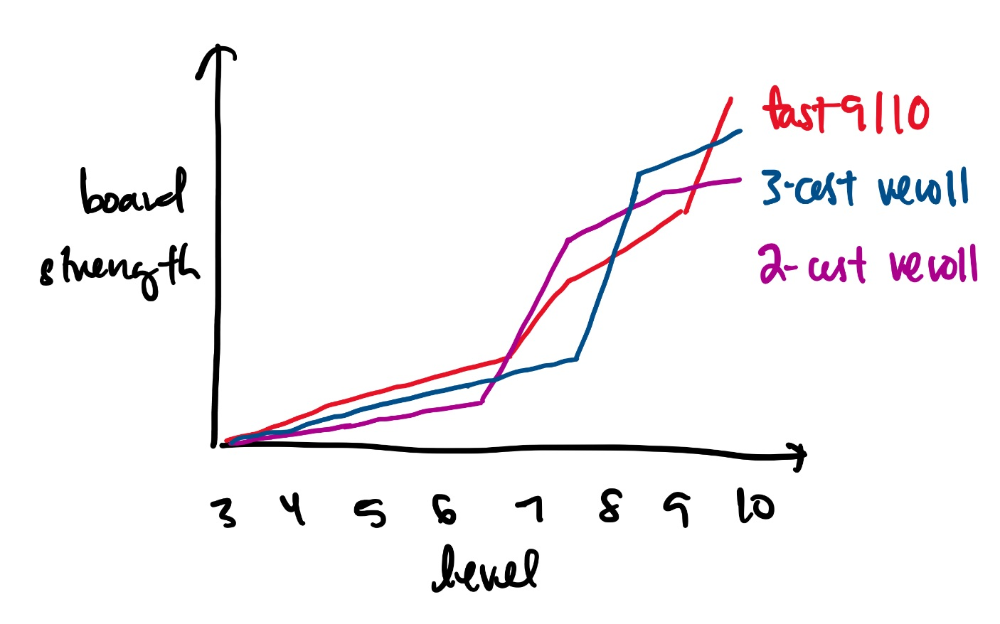

image::../../../images/games/tft.png[]

== TFT

I've been experimenting with different TFT playstyles, and one I enjoy is "fast 9/10". To get to level 10, you need to save up all your economic resources during the early game, trading your player health for gold. If you're lucky and can easily get 2-stars of 1/2 costs during the early levels, then you should look towards this playstyle, getting a winstreak, which gives you gold without the expense of trading your player health. Of course, you can also force a losetreak, to get gold at the expense of player health. Once you're at level 9 or 10, you buy high cost units, which are all strong individually, but may not always be stronger than playing out a vertical trait. I was able to "fast 9/10" and beat other players successfully, but when I fought against the first place player, I was getting steamrolled. I was surprised, since at face value, my board was more expensive, and had more units. After the game, I thought about the item and unit compositions again, and could see some mistakes on my end.

First off, my itemization wasn't ideal for my augments; I already had stat multipliers with my augments, and my items didn't provide much raw stats to actually amplify. Additionally, against the first place player, I should have built Giant Slayer, since all their units were very "tanky", hence the main issue was that I wasn't doing enough damage. Secondly, for unit compositions, based on my augments, I could have leaned towards a more "5 cost" style board, where I just buy higher cost units who can all deal damage equally, because my team compositions was very "front-to-back"; however, the first place player had a better "front-to-back" team, since they had multiple backline damage dealers, whereas I only had one backliner, and one frontliner.

Now here's the tough part. Who's fault was it that the item and unit compositions weren't ideal? If I were given all these units and item components without needing to play out the game from level 2 to level 10, I could have crafted Rabadon's Deathcap, Blue Buff and Nashor's Tooth, instead of JG, Static Shiv and Gunblade. But I slammed Static Shiv and Gunblade during levels 4-6 in order to utilize my silver augment, which rewards you gold for breaking a lose or win streak, and to preserve health in the mid-game. Being able to save up enough money to go to level 10 means that early game you're saving up money, meaning your board strength is relatively weaker than other boards. When mid-game arrives, you have to start building up board strength, or you might just die with alot of resources. Item components especially, do not "gain" more value just sitting on your bench. While saving money gives you more interest, saving item components means you could be losing fights that you could have won, had you used your items. Additionally, I was given a lesser champion duplicator, which I used to get my 3-star carry. If I wasn't given this lesser champion duplicator, I would have probably not tried to 3-star this unit. Could I have been more greedy with item slamming? Could I have chosen a better unit to 3-star? Ultimately, to beat the 7 other players, you must pick your choices, and your playstyle based on the opportunities given to you during the game. But how do I know if I've done this properly?

Realistically, I'll never know for sure, which is why I think TFT represents the gamble of luck and oppertunity, a game we partake in everyday; link:https://youtu.be/OqlPU1CKEpI?si=zuTyWyMQdpxNdFrL&t=234["don't die is the most played game by everyone all over the world, every day."].

image::../../../images/games/ttt.jpg[]

== Is life just a game? Is life about religion?
When I was in high school, I wrote about, link:/posts/notes/2021-05-02-do-good-explanations-have-to-be-true[religion and science] for the TOK (Theory of Knowledge essay).

At the end of the day, games are just resource management and endless possibilities.
